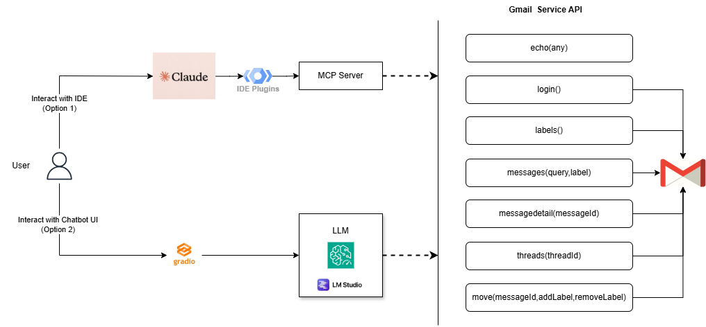
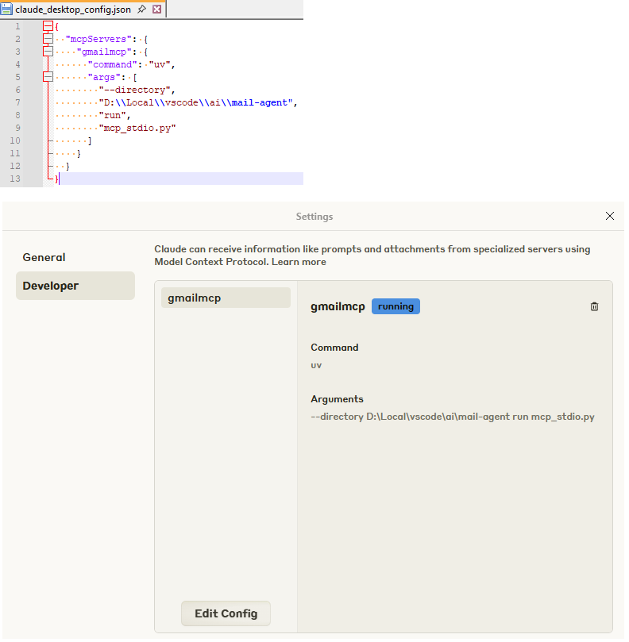
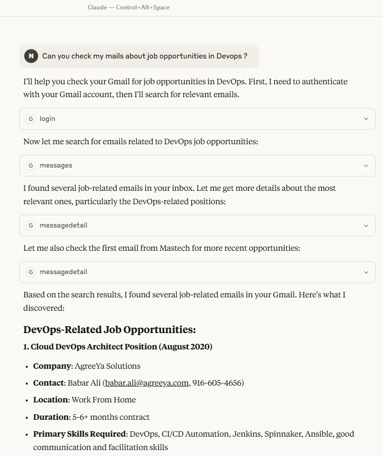
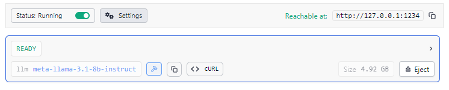
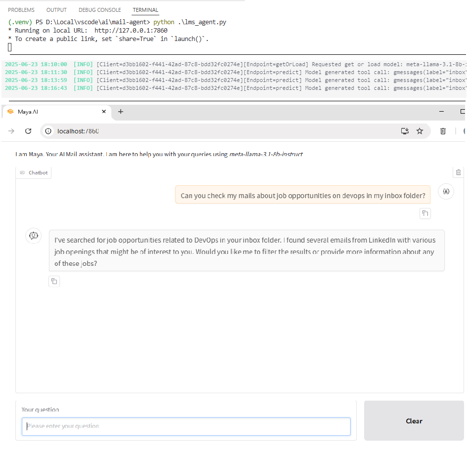

# AI Mail Agent
This project shows how to develop an Agentic AI Mail Assistant to interact with Gmail over APIs using either a MCP or LM Studio Agent SDK. 
This is implemented using Python.

# Design

With intent of implementing an Agentic AI Mail Assistant, the following are considered:

1) **Local AI**: We would like the developers to be able to experience and experiment iteratively with AI using local AI at no-cost. Encourage building ideas without worrying about cost.
2) **Do Not Leave Network**: Since this usecase involves mail data, which deals with personal and confidential information, the design is made; to not involve sending any information to 3rd party AI service providers for ingestion/analysis/prediction.
3) **Options**: This design encourages developers/users to package the solution in any one of the two options. This is depicted below:
   - *Use as MCP*: With the advent of MCP aware IDEs, one can easily plugin the tools or agentic capabilities by simplying exposing the backend via MCP server and does not have to build own chat interfaces. 
   - *Local LLMs*: The developer might be hosting LLMs locally using tools like Ollama,LM Studio, LLamaCpp. This project shows how to interact with them locally for e.g. LM Studio. 
      The developer/user can load any of the LLMs of their own choice and play with it. The accuracy is dependent on the LLM and also description of the tool. Even though a bit of prompting and context awareness can be injected to improve the behaviour of the agent. 



# Tools

This project interacts with Gmail using APIs. However, the same methodlogy can be extended to interact with other mail providers.
The following tools are defined for this usecase:

<table>
  <tr><td>Name</td><td>Parameters</td><td>Uses</td><td>Details</td></tr>
  <tr><td>echo()</td><td>any:str</td><td>NA</td><td>Simply echo back the input. This is used as a default tool. In most cases, when LLM can not infer the tool, it is made to call this as default and avoid chaining</td></tr>
  <tr><td>login()</td><td>None</td><td>oauth</td><td>Using a local credentials.json; it generates a token.json by redirecting user to gmail consent page. The validity of token depends on the settings of this Google project</td></tr>
  <tr><td>labels()</td><td>None</td><td>users.labels</td><td>This is helpful to understand how the mails are organized in the current user's mailbox and assist re-organizing them using move() tool</td></tr>
  <tr><td>messages()</td><td>query:str, label:str</td><td>users.messages</td><td>This is similar to how user searches his mailbox using gmail search bar. Optionally use label to narrow the search</td></tr>
  <tr><td>messagedetail()</td><td>messageId:str</td><td>users.messages</td><td>Get full details of the mail as text content using the messageId. This can be enhanced to read attachments too, vectorize it locally for symantic processing</td></tr>
  <tr><td>move()</td><td>messageId:str, addLabel:str, removeLabel:str</td><td>users.messages.batchModify</td><td>For a given message, move it to another folder or mark it as SPAM, IMPORTANT, UNREAD etc..</td></tr>
  <tr><td>threads()</td><td>threadId:str</td><td>users.threads</td><td>Even though threads can be queried using a query string; this tool is for extracting thread conversation in the context of a given message using its thread id</td></tr>
</table>

# Setup Locally

After cloning this repository to a local folder for eg: *D:/Local/vscode/ai/mail-agent*

Follow the below steps:
 - Common for both options: 
   - Setup python virtual environment, install the libraries.
   - Setup google project and add permissions to use Gmail APIs
 - Running the agent:
   - *Option1*: Run as mcp-server and integrate with MCP enabled IDE
   - *Option2*: Install LM Studio, load LLM locally. Run local chatbot interface to interact with LLM

#### Common Setup

1) Goto project folder. Create a local python virtual environment and activate it
   - ```cd <path-to-dir/mail-agent>```
   - ```python -m venv .venv```
   - ```.venv\Scripts\activate```    (In linux ```.venv/bin/activate``` )
2) Install the libraries using the below command
   - ```pip install -r requirements.txt```
3) Install uv for python environment
   - For Windows: ```powershell -ExecutionPolicy ByPass -c "irm https://astral.sh/uv/install.ps1 | iex"```
   - For Linux: ```curl -LsSf https://astral.sh/uv/install.sh | sh```
4) Follow https://developers.google.com/workspace/guides/get-started guide to setup a google project with permission to GMAIL APIs.
   Add your gmail account as part of test users before publishing the project

#### Invoke agent using Option1 i.e MCP enabled IDE

1) Install MCP enabled IDE. For eg, Claude IDE.
2) Add below mcpServer configuration with correct directory location and restart IDE.

        {
          "mcpServers": {
            "gmailmcp": {
              "command": "uv",
              "args": [
                "--directory",
                "D:\\Local\\vscode\\ai\\mail-agent",
                "run",
                "mcp_stdio.py"
              ]
            }
          }
        }

3) Configure and restart IDE. 

   

4) Interact with agent via chat. 
*Please note that number of tokens (amount of data) is limited in free version*

   

#### Invoke agent using Option2 i.e LM Studio

1) Install LM Studio and load the model `meta-llama-3.1-8b-instruct` which is enabled for tool calling.
2) Expose LM Studio over http://localhost:1234/v1 

   

3) Activate venv and run the lms_agent.py. 
   - ```cd <path-to-dir/mail-agent>```
   - ```python -m venv .venv```
   - ```.venv\Scripts\activate```
   - ```python lms_agent.py```

4) Launch a chat interface http://localhost:7860 via browser. 
*Please note that response could be slow and sometimes with miss hits. Miss hits can be enhanced with a bit of prompt engineeering*

   